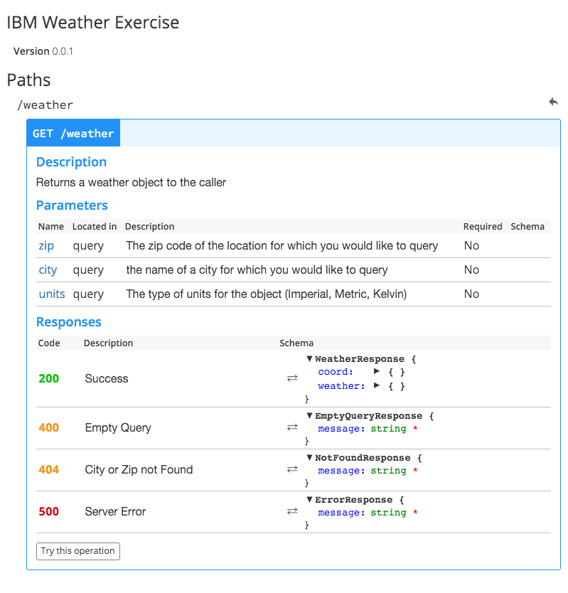

#OpenWeatherMap wrapper

### What this is
This project is a simple swagger api that wraps the openweather api. 

### Why
IBM asked me to do this in the process of interviewing

### Usage
You can open the swagger editor by running

```sh
$ npm install 
$ swagger project edit
```

This will open the editor in a browser. With the swagger editor, you can how to structure an API call and make test calls.


